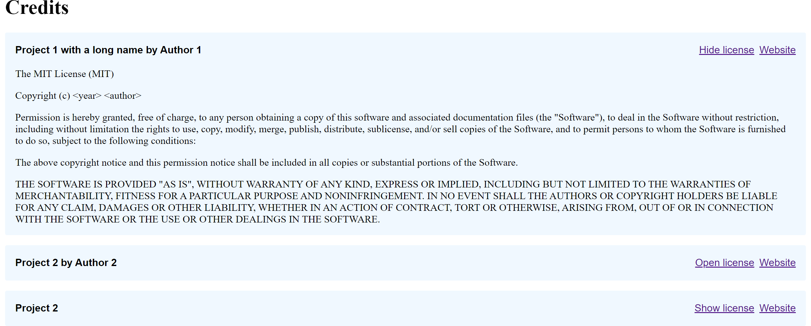

# Credits

A React component for a credit entry on a credits page.



## How to install

```sh
npm install @sanjo/credits
```

Also requires React to be installed. Can be done with `npm install react`.

## How to use

```js
import { Credit } from "@sanjo/credits"
import "@sanjo/credits/Credit.css"

const credits = [
    {
      name: "Project 1",
      author: "Author 1",
      url: "http://example.com",
      license: `A license
      
License text.
      `,
    },
    {
      name: "Project 2",
      author: "Author 2",
      url: "http://example.com",
      licenseUrl: "https://creativecommons.org/licenses/by-sa/3.0/",
    }
]

export function Page() {
  return (
    <>
      <h1>Credits</h1>
      
      {credits.map((credit, index) => (
        <Credit
          key={index}
          {...credit}
        />
      ))}
    </>
  )
}
```

For Next.js examples, checkout [here](https://github.com/SanjoSolutions/credits/tree/main/next.js).
